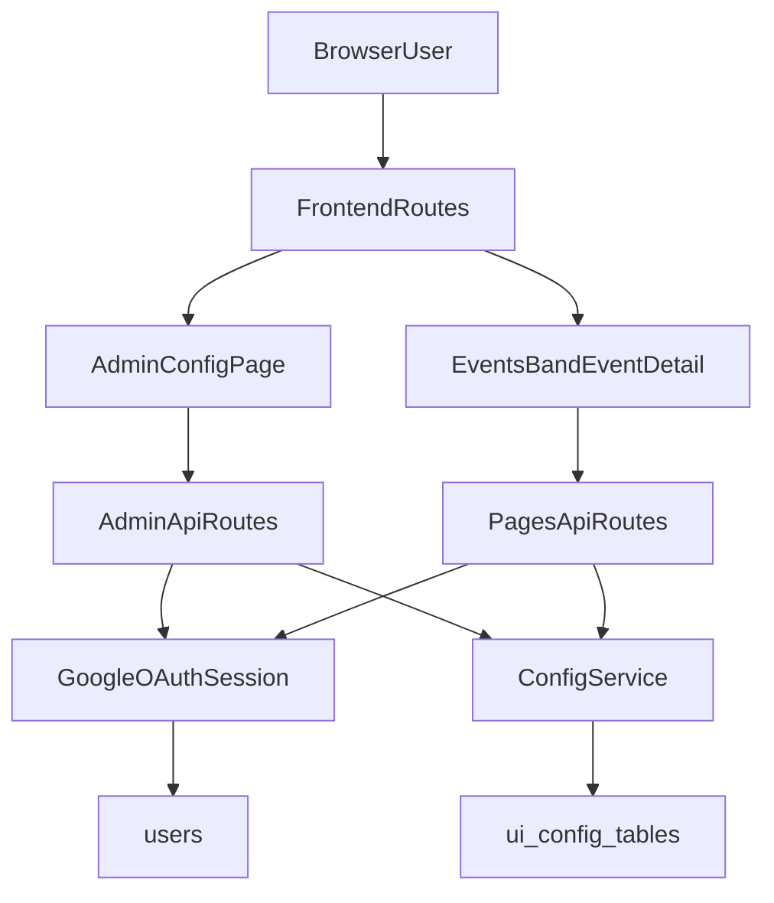

# GOD Admin Control Panel Plan

## Goal

Build a secure, WordPress-like admin area that only GOD can access initially, with future capability to grant access to specific users. Admin can configure listing/filter behavior per page, stored in DB.

## Scope and Principles

- Keep existing app behavior stable by default.
- Introduce config-driven filtering/listing incrementally (Events first, then extend).
- Backend remains source of truth for authorization and config.

## Proposed Architecture

## Data Model (DB-backed config)

Create dedicated config tables (minimal first version):

- `admin_access`
  - `user_id`, `can_access_admin`, `granted_by_user_id`, timestamps
  - GOD always implicitly allowed.
- `page_listing_config`
  - `page_key` (`events_schedule`, `events_ledger`, etc.), `listing_mode`, `default_timeline`, `default_band_scope`, `archive_enabled`, timestamps
- `page_filter_config`
  - `page_key`, `filter_key`, `enabled`, `default_value`, `sort_order`, `options_json`, timestamps
- `config_audit_log`
  - `entity`, `entity_id`, `action`, `changed_by_user_id`, `diff_json`, timestamp

## Backend Implementation Plan

1. **Google OAuth and session auth (authoritative)**
  - Add proper Google login callback/session middleware.
  - Replace current dev-only identity middleware in [c:\xampp\htdocs\bandwidth\backend\src\index.ts](c:\xampp\htdocs\bandwidth\backend\src\index.ts).
  - Keep `/api/me` shape compatible for frontend.
2. **Admin authorization layer**
  - New middleware: `requireAdminConsoleAccess`:
    - allow if `role='GOD'`
    - or user in `admin_access` with `can_access_admin=1`.
3. **Admin config API**
  - New route file: `backend/src/routes/adminConfig.ts`.
  - Endpoints:
    - `GET /api/admin/config/pages`
    - `GET /api/admin/config/pages/:pageKey`
    - `PUT /api/admin/config/pages/:pageKey/listing`
    - `PUT /api/admin/config/pages/:pageKey/filters`
    - `PUT /api/admin/access/users/:userId` (grant/revoke future access)
4. **Config service integration in page endpoints**
  - Update [c:\xampp\htdocs\bandwidth\backend\src\routes\pages.ts](c:\xampp\htdocs\bandwidth\backend\src\routes\pages.ts) to read defaults from config tables.
  - Support query params + defaults:
    - schedule: `timeline`, `band`, `archive`, `page`, `pageSize`
    - ledger: `unpaidOnly`, `band`, `archive`, `page`, `pageSize`
  - Keep SQL filtering in services ([c:\xampp\htdocs\bandwidth\backend\src\services\eventsService.ts](c:\xampp\htdocs\bandwidth\backend\src\services\eventsService.ts), [c:\xampp\htdocs\bandwidth\backend\src\services\ledgerService.ts](c:\xampp\htdocs\bandwidth\backend\src\services\ledgerService.ts).

## Frontend Implementation Plan

1. **Admin section (GOD-only UI route)**
  - Add route `/admin/config` and sidebar link visible only when backend confirms access.
  - New page: `frontend/src/pages/AdminConfig.tsx`.
2. **Admin page features (v1)**
  - Page picker (which page config to edit).
  - Listing defaults controls (timeline/band/archive toggle/default mode).
  - Filter controls list with enable/disable, order, default values.
  - Save + reload + success/error states.
3. **Filter/listing system adoption**
  - Reuse shared `FilterBar`/`Listing` foundation already created.
  - Update events data hook to request backend-filtered defaults and apply lightweight client filtering only as UX refinement.
4. **Auth UX**
  - Add login/logout flow handling and protected route behavior for admin page.

## Rollout Strategy (Low Risk)

1. Add DB schema + seed default config rows for current pages.
2. Implement OAuth/session and keep old APIs compatible.
3. Implement admin config APIs and page (read-only first, then write).
4. Connect events endpoint defaults to config.
5. Enable write actions in admin UI and audit log.
6. Extend to other listing pages after Events proves stable.

## Acceptance Criteria

- `/admin/config` inaccessible to non-authorized users (backend-enforced).
- GOD can view/edit listing/filter defaults in DB.
- Events page respects DB defaults for schedule/ledger fetch behavior.
- Existing non-admin routes keep working.
- Build/lint pass frontend + backend.
- Audit log records admin config changes.

